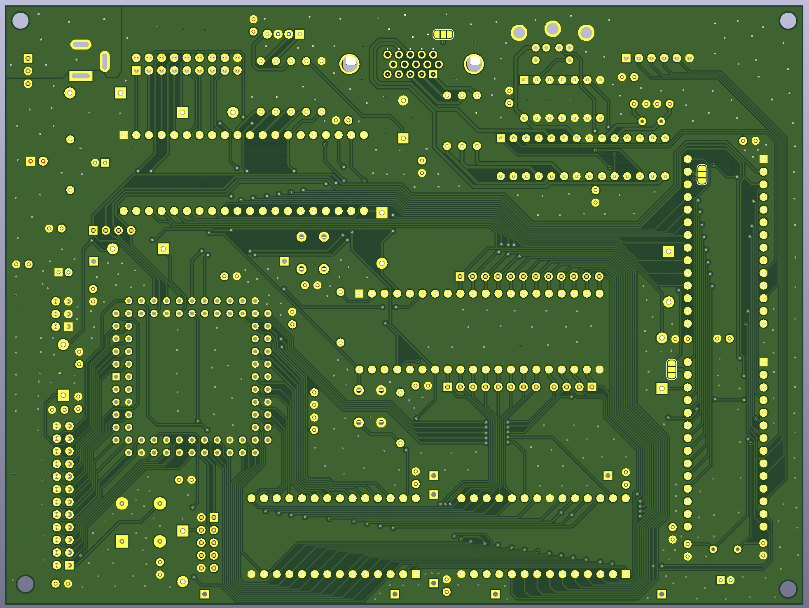
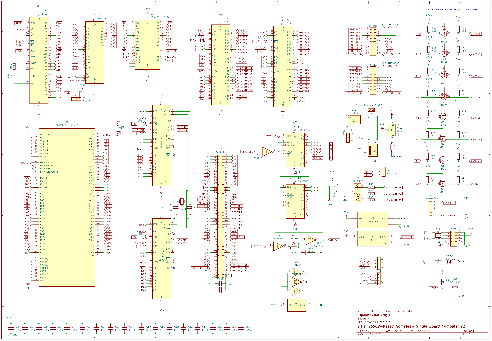

# 💻 vz6502: A Homebrew Single Board Computer Based on WDC 65C02

A custom-built single board computer (SBC) powered by the WDC 65C02 processor, featuring VGA and PS/2 interfaces, an onboard terminal, and a CPLD-based system controller.

---

## ⚙️ Specifications

- **CPU:** WDC 65C02 @ 1.8432 MHz (chosen for UART-compatible clock rate)
- **System Controller:** Altera EPM7128SLC84 CPLD
- **ROM:** Atmel 28C256 EEPROM (16 KB used)
- **RAM:** Hitachi 62256 SRAM (28 KB used)
- **Serial Interfaces:**  
  - 2× 65C51 ACIA (UART and terminal communication)
- **I/O Interface:**  
  - 1× 65C22 VIA
- **Video Output:** VGA interface  
- **Input:** PS/2 keyboard  
- **Terminal:** Atmega328P-based serial terminal

## 🧩 PCB Design

  
  
<em>Front side of the PCB</em>

  
  
<em>Back side of the PCB</em>

## 🔌 Schematic

  
  
<em>System schematic showing CPU, RAM, ROM, I/O, and video interfaces</em>

## 🧠 Memory Map Overview

### 📋 Detailed Address Mapping

| Unit   | First Address (bin)          | Last Address (bin)           | Address Range (Hex) | Description            | Size  |
|--------|------------------------------|------------------------------|---------------------|------------------------|-------|
| RAM    | 0000 0000 0000 0000          | 0110 1111 1111 1111          | 0000–6FFF           | System memory          | 28 KB |
| VIA0   | 0111 0000 0000 0000          | 0111 0000 0000 1100          | 7000–700C           | VIA 0 registers        | 12 B  |
| VIA1   | 0111 0001 0000 0000          | 0111 0001 0000 1100          | 7100–710C           | VIA 1 registers        | 12 B  |
| ACIA0  | 0111 0010 0000 0000          | 0111 0010 0000 0011          | 7200–7203           | ACIA 0 registers       | 4 B   |
| ACIA1  | 0111 0011 0000 0000          | 0111 0011 0000 0011          | 7300–7303           | ACIA 1 registers       | 4 B   |
| RESRV  | 0111 0100 0000 0000          | 0111 1111 1111 1111          | 7304–7FFF           | Reserved               | N/A   |
| ROM    | 1000 0000 0000 0000          | 1111 1111 1111 1111          | 8000–FFFF           | System ROM             | 32 KB |

---

## 📁 File Structure

| Folder   | Description                        |
|----------|------------------------------------|
| `/pcb`   | KiCAD PCB design files             |
| `/gerber`| Gerber files for PCB manufacturing |
| `/ext`   | GitHub assets, images, and extras  |

---
⚠️ CPLD and operating system source files will be uploaded in a future update.